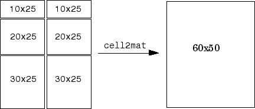

埃博拉酱的MATLAB工具包，包含简单的单文件MATLAB函数
# ColorAllocate
为白色背景下的作图分配合适的颜色

作图时不知道使用什么颜色最显眼、最有区分度？本函数生成白色背景下的最优化配色方案。如果背景是黑色，用255减去分配出的颜色即可。

本函数会自动保存以前的计算结果，可以重复利用加快计算。
```MATLAB
Data=rand(9,9);
tic;
Colors=ColorAllocate(9)
toc
figure;
hold on;
for a=1:9
	plot(Data(a,:),"Color",Colors(a,:));
end
%再次调用速度加快，因为保存了之前的结果
tic;
Colors=ColorAllocate(9)
toc
```
## 输入参数
NoColors(1,1)uint8，必需参数，要分配的颜色个数

TryCount(1,1)uint8=0，可选位置参数，尝试优化的次数。一般来说次数越多优化效果越好，但更消耗时间。默认如果找到了保存的计算结果就不再尝试优化，否则优化1次。
## 返回值
Colors(:,3)，每一行代表一个颜色的RGB值
# DelimitedStrings2Table
将一列分隔符字符串的前几个字段读出为表格或时间表
分隔符字符串列如下形式：
```
4003.20210204.BlueBase.All.10%400V_0002.Registered.Measurements.mat
4003.20210204.BlueBase.PV.10%400V_0002.Registered.Measurements.mat
4003.20210204.GreenRef.All.10%400V_0005.Registered.Measurements.mat
4003.20210204.GreenRef.PV.10%400V_0005.Registered.Measurements.mat
```
每行一个字符串，字符串用特定的符号分割成了一系列字段。如果前几个字段有固定的意义且在所有字符串中都存在，则可以将它们读出成表。如果某个字段是时间，还可以读出成时间表。
## 必需参数
Strings(:,1)string，分隔符字符串列

FieldNames(1,:)string，从头开始按顺序排列每个字段的名称。如果有时间字段，直接跳过，不要在FieldNames里指示，也不要留空，而是直接将后面的字段提前上来。

Delimiter(1,1)string，分隔符，将传递给split用于分隔。
## 可选位置参数
TimeField(1,1)uint8=0，时间字段在字符串中是第几个字段。如果设为0，则没有时间字段，返回普通表；否则返回时间表。

DatetimeFormat(1,:)char='yyyyMMddHHmmss'，日期时间格式。不支持含有分隔符的日期时间格式，时间字段字符串必须全为日期时间数字，如"20210306", "202103061723"等。如果实际的字段长度不足，将会自动截短格式字符串以匹配之。将作为datetime函数的InputFormat参数。时间字段在所有字符串之间不需要长度相同。如果TimeField为0，将忽略该参数。
## 返回值
Table(:,:)，如果TimeField为0，返回table，否则返回timetable。
# DimensionFun
对数组按维度执行函数，支持单一维度隐式扩展和返回数组自动拼接

对数组进行批处理是十分常用的操作。但是arrayfun和cellfun只能进行按元素运算，不能按行、按列甚至按平面运算，而且不支持单一维度隐式扩展，如果返回值不是标量还不能自动拼接。采用本函数可以实现按任意维度运算，且支持单一维度隐式扩展，返回数组自动拼接。
```MATLAB
%% 图像拼接-1
%本示例将一系列宽度相同的图片纵向拼接成一张长图。假设ImagePaths是一个包含了待拼接图像路径的列向量
imshow(DimensionFun(@imread,ImagePaths,"CatMode","Linear"));
%由于ImagePaths是向量，且imread返回uint8数值类型，因此以下写法也是等效的：
imshow(DimensionFun(@imread,ImagePaths,"CatMode","Linear"));
%% 图像拼接-2
%同样是拼接图象，如果ImagePaths是一个待拼接的子图路径的矩阵呢？同样可以按照这个矩阵对这些图像自动进行二维拼接！
imshow(DimensionFun(@imread,ImagePaths,"CatMode","CanCat"));
%% 异形数组拼接
A={1 [2 3]
[4 5] 6}
%此元胞数组直接使用cell2mat拼接会报错，但可以使用本函数拼接：
C=DimensionFun(@cell2mat,A);
%此示例仅用于展示DimensionFun的拼接功能，实际上可以直接使用SuperCell2Mat(A)一步到位。本函数实际上也是调用该函数实现的。
%% 序列采样-拆分打包与隐式扩展的相互作用展示
Sequence=1:10;
Start=(1:5)';
End=(6:10)';
disp(DimensionFun(@(Sequence,Start,End)Sequence(Start:End),Sequence,Start,End,"SplitDimensions",1,"CatMode","Linear"));
%输出
%     1     2     3     4     5     6
%     2     3     4     5     6     7
%     3     4     5     6     7     8
%     4     5     6     7     8     9
%     5     6     7     8     9    10
%注意，由于SplitDimensions仅为第1维，因此具有单一第1维的Sequence发生了隐式扩展，而具有单一第2维的Start和End未发生隐式扩展，而是直接打包交付给Function运算。
```
## 必需参数
Function(1,1)function_handle，要执行的函数。必须接受等同于Arguments重复次数的参数
## 重复参数
Arguments，输入参数数组。输入的数组个数必须等于Function所能接受的输入值个数。所有数组各维度尺寸要么相等，要么为1，不允许各不相同的维度尺寸。不允许输入表格或其它非MATLAB标准数组，请始终先转化为MATLAB数组或元胞数组。
## 名称-值对组参数
以下两个名称-值对组参数只能选择其中一个进行指定，另一个将会自动计算得出。如果两个参数都不指定，将把第一个Arguments所有非单一维度视为SplitDimensions，其它维度作为PackDimensions。
- PackDimensions(1,:)uint8{mustBePositive}，将每个Arguments数组的指定维度打包，在其它维度（即SplitDimensions）上拆分，分别交付给Function执行
- SplitDimensions(1,:)uint8{mustBePositive}，在每个Arguments数组的指定维度上拆分，将其它维度（即PackDimensions）打包，分别交付给Function执行

注意，拆分-打包步骤在隐式扩展之前。也就是说，由于PackDimensions指定的维度被包入了同一个元胞当中，尺寸恒为1，即使不同数组间这些维度具有不同的尺寸，也不会进行隐式扩展。隐式扩展仅在SplitDimensions中进行。

CatMode(1,1)string="CanCat"，返回值拼接选项，根据Function的返回值设定，必须为以下四者之一：
- Scalar，Function的返回值为标量，将调用arrayfun完成拼接。
- Linear，SplitDimensions为标量，且Function的返回值为类型、PackDimensions维度上尺寸均相同的数组。将调用cat完成拼接。
- EsNlcs，Function的返回值为数值、逻辑、字符或字段相同的结构体数组，且尺寸完全相同。将调用cell2mat完成拼接。
- CanCat，Function的返回值为数组，允许尺寸不同，但最终可以拼接成一整个大数组。将调用SuperCell2Mat完成拼接。
- DontCat，不符合上述任何条件，或返回值为函数句柄。将不会拼接，返回元胞数组。

无论何种情况，都可以设为DontCat；其它选项都必须满足特定条件（对Function的每个返回值）。此外若Function的任何一个返回值是函数句柄，都只能选择DontCat。对于任何可拼接的情况，选择CanCat都能完成拼接，但性能最低。如果您确定您的函数返回值可以满足更苛刻的条件，应尽量优先选择Scalar>Linear>EsNlcs>CanCat。
## 返回值
返回值为由Function的返回值按其所对应的参数在数组中的位置拼接成的数组。如果Function具有多个返回值，则每个返回值各自拼接成数组，作为本函数的多个返回值。根据CatMode不同：
- Scalar，返回数组，尺寸与每个Arguments在SplitDimensions上隐式扩展后的尺寸相同，PackDimensions上尺寸为1
- Linear & EsNlcs & CanCat，返回数组，该数组由返回值在SplitDimensions维度上的拼接得到
- DontCat，返回元胞数组，尺寸与每个Arguments在SplitDimensions上隐式扩展后的尺寸相同，元胞里是对应位置的Arguments输入Function产生的返回值。PackDimensions上尺寸为1。
# FigureAspectRatio
设置当前图窗的纵横比

在MATLAB之外对图窗进行不维持纵横比的拉伸，往往会导致字符也被扭曲。为了避免这种情况，建议在导出之前在MATLAB内部设置好图窗的纵横比。
```MATLAB
%假设当前图窗的尺寸为：宽度×高度=400×300
FigureAspectRatio(3,2);
%图窗面积仍为120000，但尺寸变为424×283，即3:2
FigureAspectRatio(2,1,"Amplify");
%相对于2:1的比例要求来说，283的高度是较大的，424的宽度是较小的，因此拉宽到566×283
FigureAspectRatio(1,1,"Narrow");
%相对于1:1的比例要求来说，283的高度是较小的，566的宽度是较大的，因此压扁到283×283
FigureAspectRatio(1,2,2);
%当前面积283×283=80089，放大2²=4倍变成320356，分配宽度1、高度2的比例，则得到400×800
```
## 必需参数
HorizontalProportion(1,1)，宽度比值。例如如果你希望图窗为4:3，则此值给4

VerticalProportion(1,1)，高度比值。例如如果你希望图窗为4:3，则此值给3
## 可选参数
Scale=1，缩放倍率或模式。
- 若为1，表示缩放后的图跟原图面积相等
- 若为某值k，则缩放后的面积变成缩放前的k²倍
- 若为"Amplify"，则保持当前比值相对较大的一边长度不变，仅拉长另一边到给定比值
- 若为"Narrow"，则保持当前比值较小的一边长度不变，仅压缩另一边到给定比值
## 名称-值对组参数
Fig(1,1)matlab.ui.Figure=gcf，图窗对象。如果指定该参数，将对指定的图窗进行操作，而不一定是当前图窗。
## 返回值
Fig(1,1)matlab.ui.Figure，如果制定了Fig参数，则返回该参数；否则返回当前图窗对象。
# FolderFun
取对一个文件夹下所有满足给定文件名模式的文件的绝对路径，对它们执行函数
## 必需参数
Function(1,1)function_handle，要执行的函数句柄。必须接受1个文件路径作为输入参数。

Directory(1,1)string，要遍历的文件夹路径
## 可选参数
Filename(1,1)string="*"，要筛选出的文件名模式，默认所有文件
## 名称-值对组参数
UniformOutput(1,1)logical=true，是否将输出值直接拼接成向量。若false，则将每个输出值套上一层元胞以后再拼接成向量。如果Function返回的不是标量，必须设为false。
## 返回值
每个文件路径执行函数后的返回值向量。如果Function有多个返回值，则返回同样多个向量，每个向量元素对应位置都是对一个文件调用Function产生的返回值。根据UniformOutput的设定，这些元素有可能还会套在一层元胞里。
# OpenFileDialog
可以设置初始目录，以及保存上次所在目录的文件打开对话框

MATLAB自带的uigetfile只能将初始目录设为当前目录，且下次打开时不能自动恢复到上次打开的目录，十分不便。本函数调用System.Windows.Forms.OpenFileDialog解决了这一问题。
## 名称-值对组参数
### Filter
(1,1)string，文件名筛选器。

对于每个筛选选项，筛选器字符串都包含筛选器的说明，后跟竖线和筛选器模式。 不同筛选选项的字符串用竖线分隔。

下面是筛选器字符串的示例：
```
Text files (*.txt)|*.txt|All files (*.*)|*.*
```
可以通过用分号分隔文件类型将多个筛选模式添加到筛选器，例如：
```
Image Files(*.BMP;*.JPG;*.GIF)|*.BMP;*.JPG;*.GIF|All files (*.*)|*.*
```
### InitialDirectory
(1,1)string，文件对话框中显示的初始目录
### Multiselect
(1,1)logical。如果对话框允许同时选定多个文件，则为 true；反之，则为 false。 默认值为 false。
### Title
(1,1)string，文件对话框标题。该字符串放置在对话框的标题栏中。 如果标题为空字符串，则系统将使用默认标题，即 "另存为" 或 "打开"。
## 返回值
FilePaths(1,:)string，包含对话框中所有选定文件的文件名。每个文件名同时包含文件路径和扩展名。如果未选择任何文件，则返回一个空数组。
# ParseRepeatingFlagArguments
分析旗帜类重复参数到逻辑变量
```MATLAB
function TiffBatchRegister(Flags)
arguments(Repeating)
	Flags(1,1)string{mustBeMember(Flags,["Silent","Sequential"])}
end
[Silent,Sequential]=ParseRepeatingFlagArguments(Flags,"Silent","Sequential");
%得到这两个旗帜是否被调用方指定的逻辑值
```
## 必需参数
InputFlags(:,1)string，调用方传来的，待分析的旗帜类重复参数
## 重复参数
ValidFlags(1,1)string，函数规定的有效旗帜
## 返回值
varargout(1,1)logical，数目与ValidFlags重复次数相同，返回每个有效旗帜是否存在（被调用方指定）的逻辑值
# RepeatingFun
重复多次调用函数，为每个重复参数生成一个返回值
## 输入参数
Function(1,1)function_handle，必需，要调用的函数句柄

Arguments，重复，每次调用的输入参数
## 返回值
varargout，每个重复输入的参数按顺序生成的返回值
# ShadowedLine
将平均值±误差曲线，通过中间一条均线、两边误差边界阴影的形式作图出来。
```MATLAB
tiledlayout("flow");
%% 基本用法
nexttile;
%生成一些随机数据
Data=rand(10,10);
%求平均值
Mean=mean(Data,1);
%求误差（此处使用SEM）
Error=std(Data,0,1)/sqrt(10);
%作图
ShadowedLine(Mean,Error);
%% 自定义样式
nexttile;
%横轴在0~1之间
Xs=linspace(0,1,10);
%阴影区为半透明红色
FillStyle={"r","FaceAlpha",0.1,"LineStyle","none"};
%图线为虚线
PlotStyle={"--"};
ShadowedLine(Mean,Error,Xs,"ShadowStyle",FillStyle,"LineStyle",PlotStyle);
```
## 必需参数
LineYs(1,:)，平均值折线Y值，将用plot函数作出

ShadowHeights(1,:)，误差范围阴影高度，将用fill函数作出
## 可选参数
Xs(1,:)=1:numel(LineYs)，X轴对应数值向量
## 名称-值对组参数
LineStyle(1,:)cell={'k'}，均值折线的样式，将传递给plot函数实现

ShadowStyle(1,:)cell={"k","FaceAlpha",0.2,"LineStyle","none"}，误差阴影的样式，将传递给fill函数实现
## 参数互限
LineYs ShadowHeights Xs，这三个向量应当具有相同的长度
## 返回值
Line(1,1)matlab.graphics.chart.primitive.Line，平均线，plot函数返回的图线对象

Shadow(1,1)matlab.graphics.primitive.Patch，误差阴影，fill函数返回的填充对象
# StructAggregateByFields
对结构体的每个字段执行累积运算，累积结果放在一个字段相同的结构体标量中返回。
```MATLAB
A(1).a=1;
A(1).b=2;
A(2).a=3;
A(2).b=4;
B=StructAggregateByFields(@cell2mat,A)
```
## 输入参数
AggregateFunction(1,1)function_handle，要执行的累积函数，必须接受一个和StructArray尺寸相同的元胞数组输入

StructArray struct，要累积的结构体数组
## 返回值
(1,1)struct，和StructArray字段相同的结构体标量，保存每个字段各自的累积运算结果。
# SuperCell2Mat
cell2mat的升级版

本函数是cell2mat的升级版，使用前请先参阅cell2mat函数文档，了解其功能和局限性。

cell2mat是一个功能十分强大的MATLAB函数，可以将元胞数组内的数组提取出来，拼成一个大数组，而且这些数组的尺寸不必完全相同，例如可以支持以下拼接：



但它也存在局限性。首先，只支持数值、逻辑、结构体、字符的拼接，其它常见数据类型（字符串、元胞、类对象）都无法使用。其次。对于以下结构，虽然尺寸恰好合适，但也无法拼接：


这是因为cell2mat默认先拼第1维，自然会遇到尺寸不匹配的问题。但我们可以看到，只要先拼第2维，就可以得到1×3和2×3两个矩阵，然后第1维就可以拼接了。本函数不仅支持各种数据类型，还会自动尝试从不同的维度进行拼接，因此支持更多复杂的结构。

输入参数：Cells cell，要拼接的元胞数组，各元胞内含有数据类型一致的数组，且各维尺寸上恰好可以拼接成一个大数组，维度不限。

返回值：拼接好的大数组